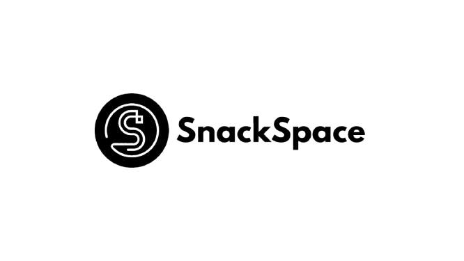
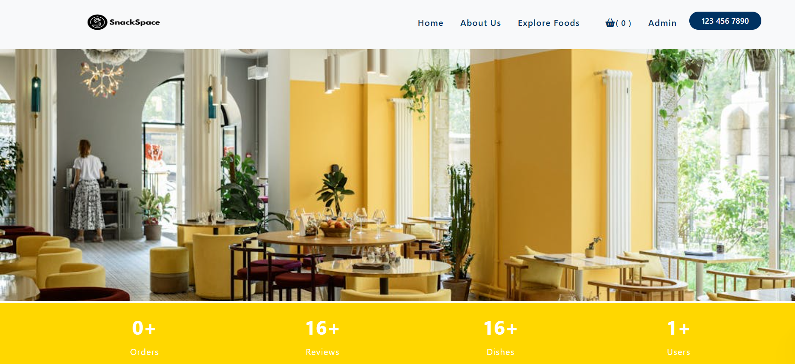
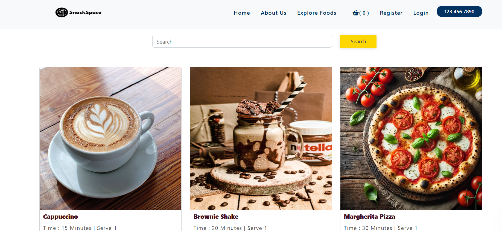
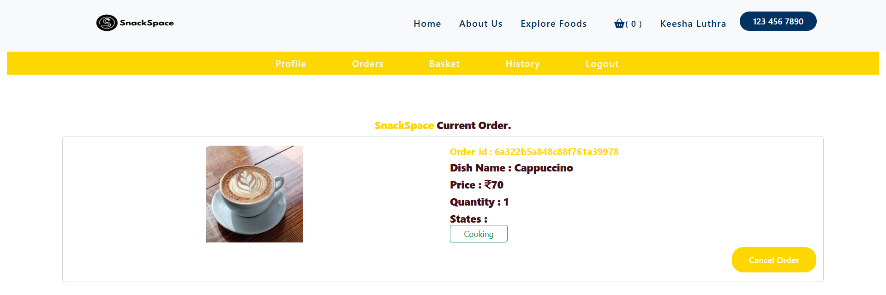
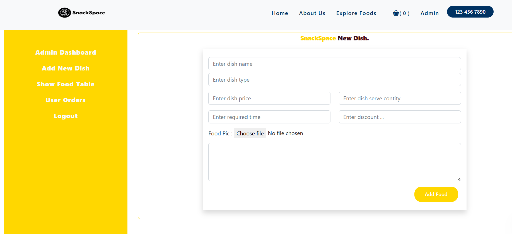
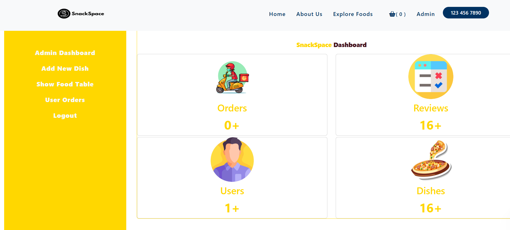

<div align="center">
  <!-- TODO: Provide path to your project's logo below -->
  

  # Snack Space
  
  **A dynamic food ordering platform connecting hungry users with their favorite meals.**

  [**🚀 View Live Demo**](https://snackspace-restaurant-management-2.onrender.com/)

  [](https://nodejs.org)
  [](https://expressjs.com/)
  [](https://www.mongodb.com/)
  [](LICENSE)

  <br />

  

</div>

---

## 🌍 Project Overview

**Snack Space** bridges the gap between hungry customers and delicious meals. It consolidates the discovery of food items, seamless ordering, and restaurant management into one clean, interactive web experience.

Originally developed as a hackathon project, Snack Space has been architecturally upgraded into a **production-ready Node.js application**. It now boasts clean repository organization, strict environment configuration, robust backend API routing, and safe file uploading mechanics.

---

## ✨ Key Features

*   🍔 **Dynamic Food Discovery:** Browse various dishes and discover new meals with a seamless search interface.
*   👨‍🍳 **Admin Dashboard:** A dedicated portal for restaurant admins to add, edit, or delete dishes.
*   📦 **Order Tracking:** Track orders from preparation to delivery.
*   🚀 **Production-Ready Backend:** A hardened Node.js Express server handling user sessions, file uploads, and MongoDB integration.
*   🛡️ **Secure Configuration:** Environment-variable driven configuration avoiding hardcoded paths or secrets.
*   ☁️ **Cloud Storage:** Integrated Cloudinary for robust and scalable dish image uploads.
*   🔒 **Enhanced Security:** Implemented `helmet` for CSP headers and robust rate limiting to protect against brute-force attacks.

---

## 🏗️ Architecture

Snack Space utilizes a robust Node.js backend to support its server-side rendered frontend using Handlebars (`hbs`).

```text
SnackSpace/
├── public/                 # Static assets (CSS, JS, Images, Dish Uploads)
├── src/                    # Server-side application logic
│   ├── app.js              # Express application entry point
│   ├── models/             # MongoDB Mongoose schemas
│   └── routes/             # API endpoints and page routing
├── views/                  # Handlebars (.hbs) templates and partials
├── screenshots/            # Application media and galleries
└── .env.example            # Environment configuration template
```

### Request Flow
`Client` ➡️ `Express Router` ➡️ `Controllers / Models` ➡️ `MongoDB` ➡️ `Handlebars Views`

---

## 📸 Application Gallery

| Home Page | Dashboard |
| :---: | :---: |
|  |  |

| Feature Example | Admin Panel |
| :---: | :---: |
|  |  |

---

## ⚙️ Installation & Local Development

**Prerequisites:** 
- [Node.js](https://nodejs.org/) v18.0+
- [MongoDB](https://www.mongodb.com/try/download/community) running locally on port `27017`

1. **Clone the repository:**
   ```bash
   git clone https://github.com/your-username/SnackSpace.git
   cd SnackSpace
   ```

2. **Install dependencies:**
   ```bash
   npm install
   ```

3. **Configure your environment:**
   Create a `.env` file in the root directory by copying the example file:
   ```bash
   cp .env.example .env
   ```
   Ensure `MONGODB_URI` and `SESSION_SECRET` are correctly set.

4. **Start the development server:**
   ```bash
   npm run dev
   ```
   *Navigate to `http://localhost:5656`*

---

## 🔒 Environment Variables

Environment variables are strictly typed and expected by the application at runtime. The server requires the following variables in your `.env` file:

| Variable | Type | Default | Description |
| :--- | :--- | :--- | :--- |
| `PORT` | `number` | `5656` | The HTTP port the Express server binds to. |
| `MONGODB_URI` | `string` | `mongodb://localhost:27017/restorent` | Local or cloud MongoDB connection string. |
| `SESSION_SECRET` | `string` | - | Secret string used for signing the session ID cookie. |

---


## 🔮 Future Improvements

While Snack Space has been structured for production readiness, our roadmap includes:

1. **Frontend Framework:** Refactoring the Handlebars UI into a modern React or Next.js application.
2. **Payment Integration:** Integrating Stripe or Razorpay for seamless checkout workflows.

<div align="center">
  <br/>
  <p>Built with ❤️ for food lovers everywhere.</p>
</div>
